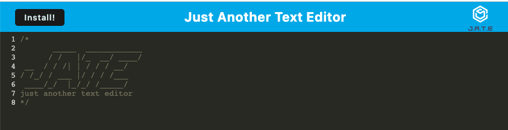

# JATE

## Description:
The Progressive Web Application (PWA) Text Editor is a browser-based text editor that allows users to create and store notes or code snippets even without an internet connection. It's a single-page application that meets PWA criteria, ensuring a seamless and responsive user experience.

## Table of Contents

- [Description](#description)
- [Usage](#usage)
- [Demonstration](#demonstration)
- [Contributions](#contributions)
- [Links](#links)
- [Technologies](technologies)
- [License](#license)

## Usage:

**Installation**

To run the text editor application, follow these steps:

1. Clone the repository and navigate to the root directory.

2. Install the necessary dependencies by running the command: npm install.

3. Start the backend server and serve the client by running: npm run start.

4. The application should now be accessible through your browser.

**Creating and Saving Content**

Upon opening the text editor, IndexedDB immediately creates a database for storage.

Enter your content, whether it's notes or code snippets, into the editor.

To save your content, click off the DOM window, and the data will be automatically saved to IndexedDB.

**Retrieving Saved Content**

If you close the text editor and reopen it later, your previously saved content will be retrieved from IndexedDB and displayed in the editor.

**PWA Installation**

To install the web application on your desktop, click on the "Install" button, and the app will be added as an icon for easy access.

## Demonstration:

1. **Home Page** 

2. **How to Install the App From Your Browser**

https://github.com/kemcclen/JATETextEditor/assets/123762040/243322b1-7f1f-4468-a62a-a5ecee30ade4

3. **How to Open JATE from VS Code**

https://github.com/kemcclen/JATETextEditor/assets/123762040/02f1e985-ec14-4c9c-936e-121a4ee511b0

4. **Save Your Work**

https://github.com/kemcclen/JATETextEditor/assets/123762040/037c1ff0-c73f-415b-806c-a2b75127c516

## Contributions: 

Contributions to JATE are welcome! If you have any improvements, bug fixes, or new features to add, feel free to submit a pull request.

To contribute to JATE, please follow these steps:

1. Fork the repository.
2. Create a new branch for your feature or bug fix.
3. Make your changes in the new branch.
4. Commit your changes, providing a descriptive commit message.
5. Push your branch to your forked repository.
6. Open a pull request against the main repository.
7. Provide a clear and concise description of your changes in the pull request.
8. Submit the pull request and wait for feedback or further instructions.

Please note that by submitting a pull request, you agree to allow the project maintainers to license your work under the project's existing license.

Thank you for considering contributing to JATE. Your contributions are highly appreciated!

## Links: 
- Repository: 
- Deployed Application: 

## Technologies

- JavaScript
- IndexedDB
- Webpack
- Workbox
- idb package (lightweight wrapper for IndexedDB)
- Heroku (for deployment)

## License:
JATE is licensed under the [MIT License](https://opensource.org/license/mit/).

_The MIT License is a permissive open-source license that allows you to use, modify, and distribute the project for both commercial and non-commercial purposes. It provides you with the freedom to customize the application to suit your needs._

_By contributing to JATE, you agree that your contributions will be licensed under the same MIT License. This ensures that the project remains open-source and accessible to the community._
